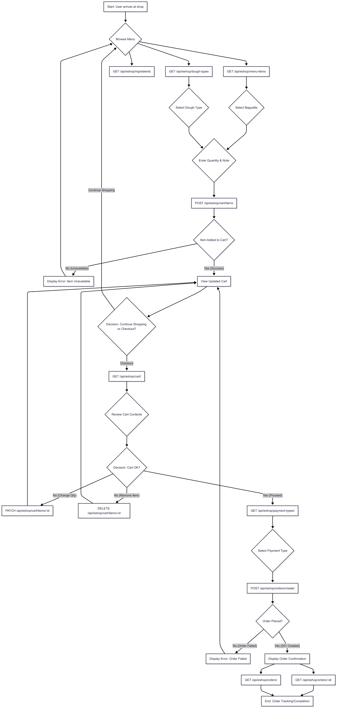
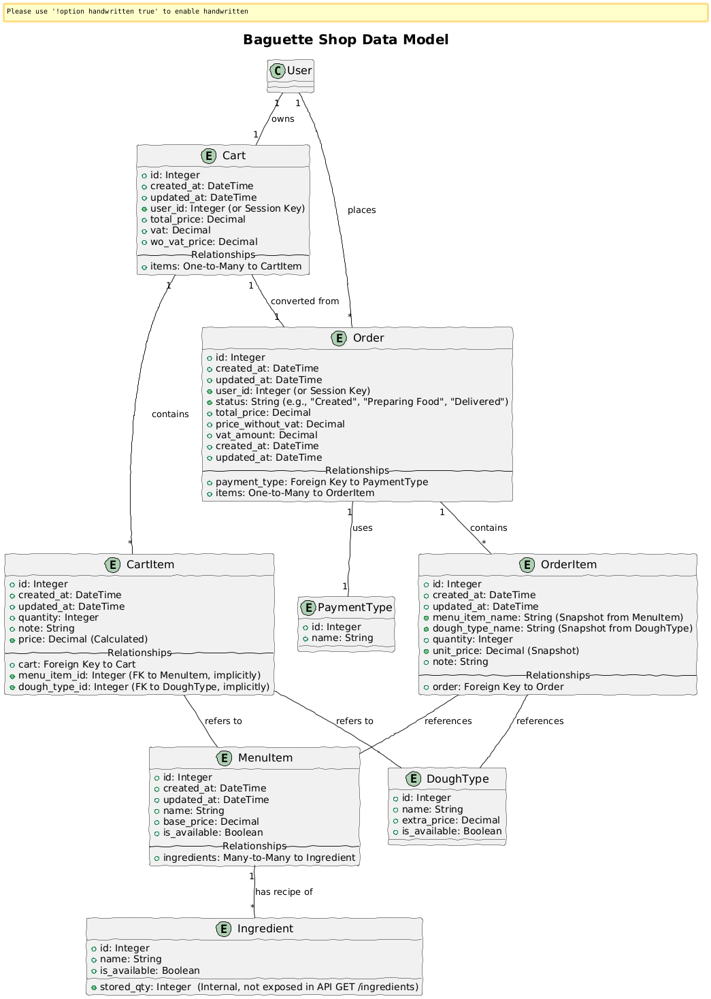

# Najada demo
Demo project for Najada games.

# 1 Technical specification
## 1.1. Core Features (User Stories)

This API provides the backend functionality for a simple online baguette shop, allowing users to:

1.  **Browse Menu Items:** View a comprehensive list of baguettes and their availability.
2.  **Manage Cart Items:** Add specific baguettes (with chosen dough type and quantity, plus notes) to the cart, and easily modify quantities or remove items.
3.  **View Cart Summary:** See a real-time list of all items in the cart, along with the calculated total price.
4.  **Submit Orders:** Finalize a purchase by submitting the cart as an order.
5.  **Track Order Status:** Monitor the state of placed orders.

## 1.2. User Flow Diagram


_This diagram visually represents the typical user journey through the application, from Browse to order completion._

## 1.3. Data model


_This diagram illustrates the entities within the system and their relationships, including how menu items, ingredients, carts, and orders are structured._

## 1.4. Key Architectural Specifics
### 1.4.1. Availability & Stock Management Strategy

For simplicity in this demo, items are **removed from stock (ingredients deducted) only when an order is successfully submitted.**

* **Rationale:** This approach prevents inventory from being tied up by abandoned shopping carts, ensuring more accurate real-time stock for available purchases.
* **Alternative Considerations:** In a production environment with high-demand or limited-stock items (e.g., concert tickets), a more complex strategy involving **temporary stock reservation at the time of adding to cart** (with time-based release for abandoned carts) might be implemented to guarantee availability for the customer during their shopping session. However, this introduces significant complexity (e.g., background tasks for cart expiration, handling concurrent reservations).

### 1.4.2. Service Layer Implementation

A dedicated **Service Layer** has been implemented to separate business logic from the API views and database models.

* **Purpose:** This design pattern ensures a clean separation of concerns, making the application more modular, maintainable, and testable.
* **Benefits:**
    * **Thin Views:** API views are lean, primarily handling request/response formatting and delegating all business operations (e.g., adding to cart, placing an order, checking availability) to the appropriate service.
    * **Decoupling:** Business rules are encapsulated within services, preventing direct model interactions in views and promoting a uniform application logic.
    * **Testability:** Services can be unit-tested in isolation, independent of the web framework or database, by mocking their dependencies.
    * **Scalability & Longevity:** This layered approach fosters a more scalable and long-lived codebase, as business logic changes are isolated and easier to manage without impacting other layers.

# 2 Development
## 2.1 Local development
### 2.1.1 Prerequisites
* **PostgreSQL database** installed and running on your host machine (version > 14).
* **Python 3.10** or higher (compatible with Django 5.2.x).

### 2.1.2 DB Initialization
Open your `psql` command-line client and create the database user and database for the project. Be sure to use credentials that match those set in your `.env` file for local development.

```bash
psql -U postgres
```
and execute:
```SQL
CREATE ROLE baguetteuser WITH LOGIN PASSWORD 'mysecretpassword';
CREATE DATABASE baguettedb OWNER baguetteuser;
GRANT ALL PRIVILEGES ON DATABASE baguettedb TO baguetteuser;
\q
```
* Note: Replace baguetteuser, mysecretpassword, and baguettedb with your chosen credentials.
### 2.1.3 Environment preparation
Create virtual env. e.g.
```bash
virtualenv venv
```
activate env.
```bash
/venv/Scripts/Activate  # source /venv/bin/activate for linux users
```

### 2.1.4 App Initialization
In `/django_project` directory Check for model changes and migrate.
```python
python .\manage.py makemigrations
python .\manage.py migrate
```
And load initial data
```python
python .\manage.py loaddata initial_data.json
```
### 2.1.5 Run server

```python
python .\manage.py runserver
```
* For local testing resources under user authentication (cart, order etc,) use Basic Auth and user `testuser` with password `password123`

## 2.2 Development with Docker
For a consistent and isolated development environment using Docker Compose:

Simply navigate to your project's root directory (where docker-compose.yml is located) and run:
```bash
docker compose build up -d
```
* This command builds the Docker images, starts all services (Django backend, PostgreSQL database), and runs them in detached mode.
* Database Setup: Database model checks, migrations, and initial data loading (from initial_data.json) are automatically handled as part of the entrypoint.sh script execution when the Django backend container starts up for the first time or is rebuilt.

## 2.3 Tests
To run the project's test suite:

Ensure you are in the active virtual environment (for local setup) or your Docker containers are running (for Docker setup).

Navigate to the `/django_project` directory.

Execute pytest:
```bash
pytest
```
## 2.4 Linting
To check code quality and adherence to style guidelines (e.g., PEP 8), run flake8:

Navigate to the `/django_project` directory and execute:
```bash
flake8 .
```

## 2.4 Logging
Application logs are generated and stored in the specified file `/django_project/api.log`
